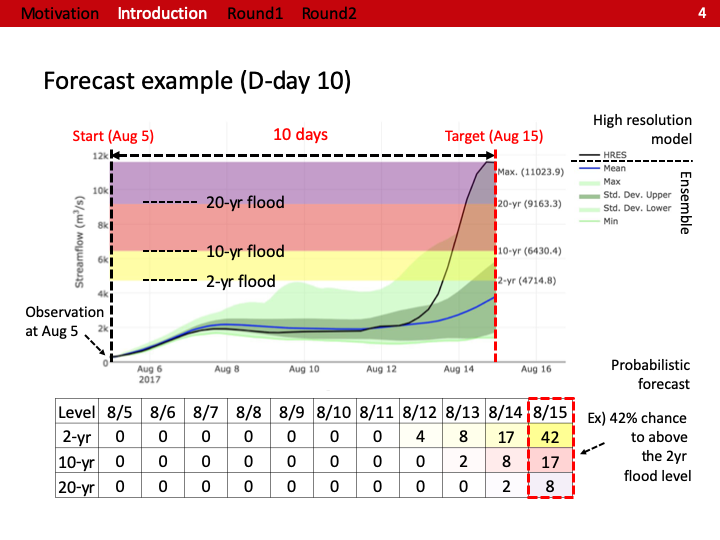
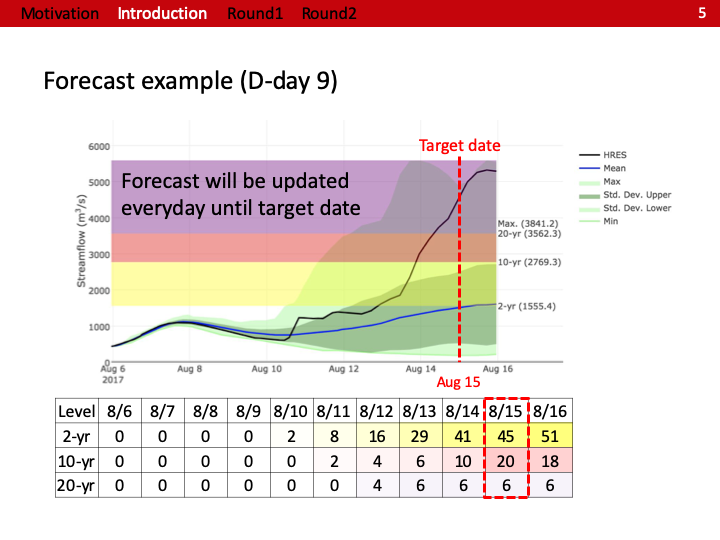
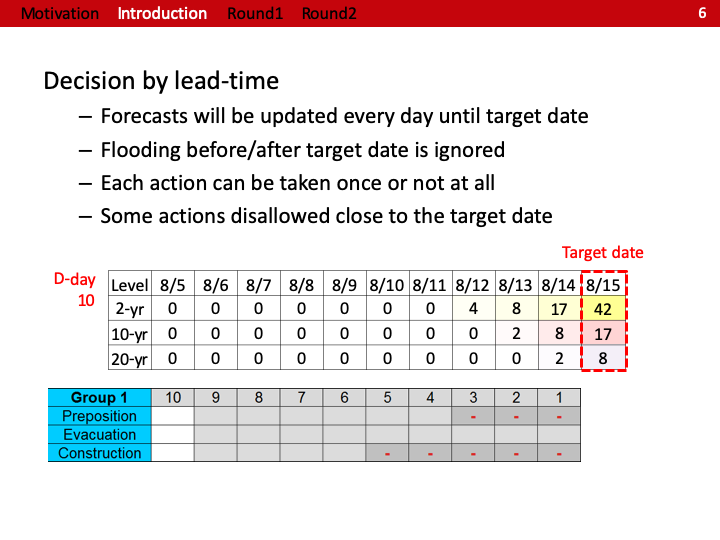

# TenDays

***Introduction***

“Ten Days for Flood Protection” is a serious game and explores risk, uncertainty and probability in the context of forecasts, illustrating one example of using a 10-day streamflow forecast to inform pre-flood management.

The TenDays has been played at the following workshops:
- Jun-2019: Joint workshop entitled "Advancing Disaster Risk Management Through Forecast-based Financing for Flood Preparedness" organized by UW-Madison, Red Cross Climate Centre, SENAMHI, and Peruvian Red Cross (40 people)
- Oct-2018: Climate, People, and Environment Program (CPEP) seminar at UW-Madison (30 people)
- Sep-2018: Environmental Fluid Mechanics & Water Resources Engineering Seminar at UW-Madison (12 people)
- Apr-2018: NASA SERVIR Hindukush Himalaya AST workshop at Dhaka, Bangladesh (70 people)
- Mar-2018: Developed by DL, EM, and PB in the Civil and Environmental Engineering at the University of Wisconsin-Madison

***Screenshots***
- Introduction of 10 days streamflow forecast\

- Early actions\

